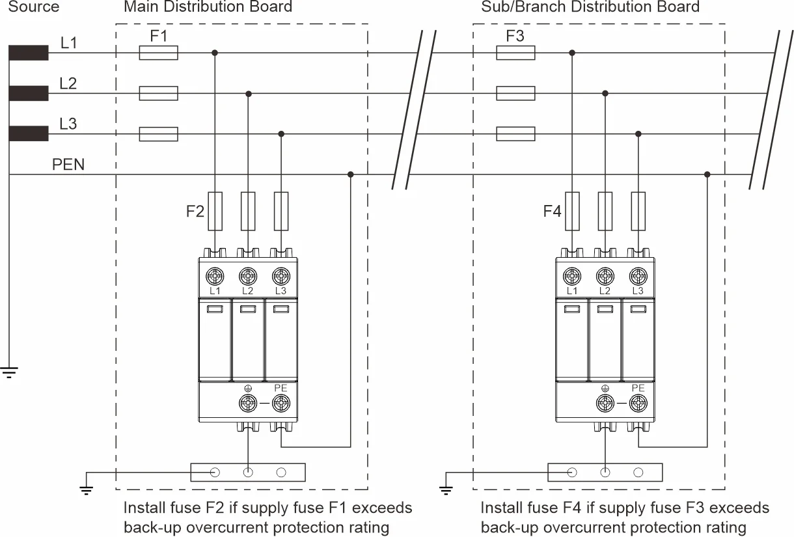
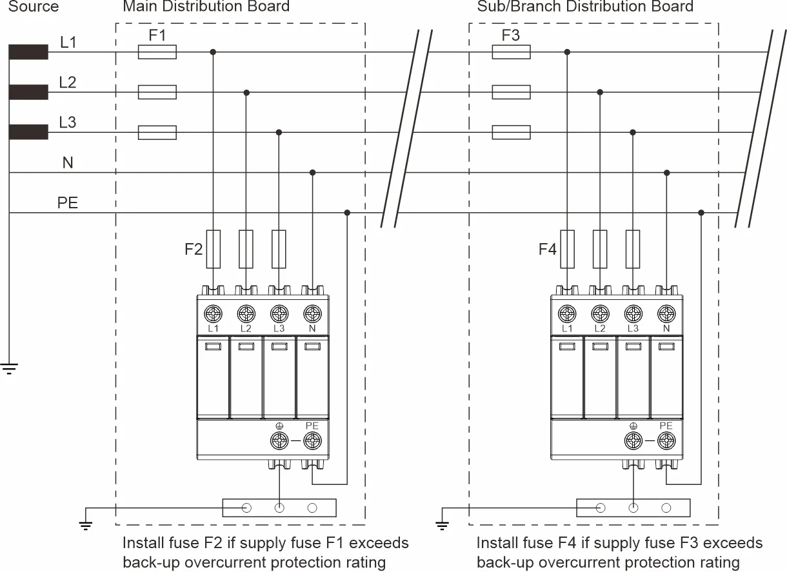
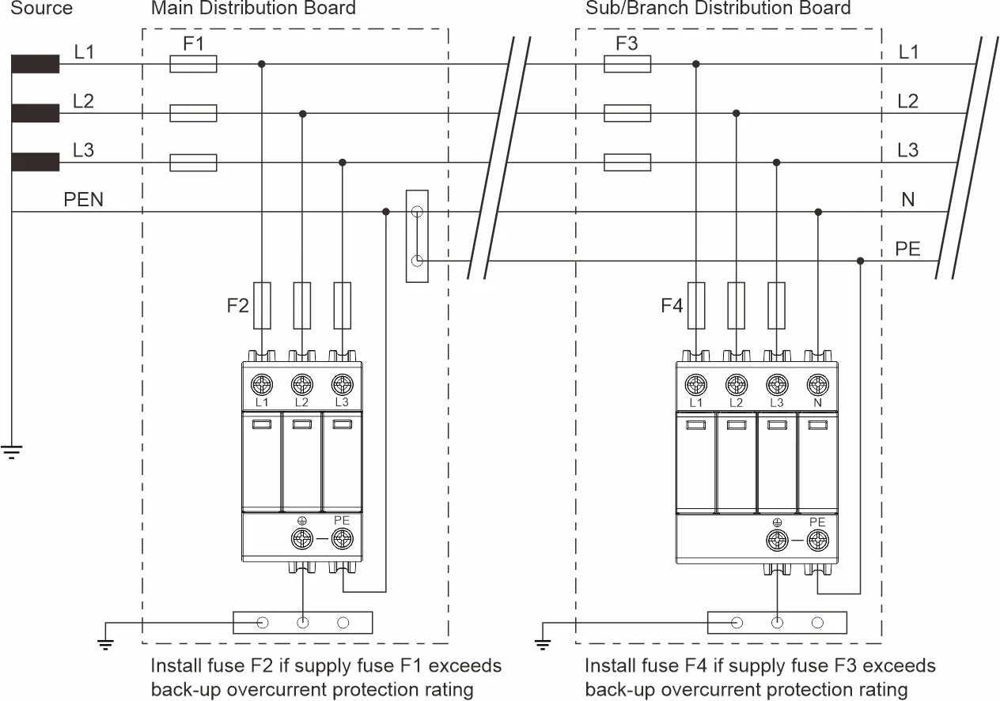
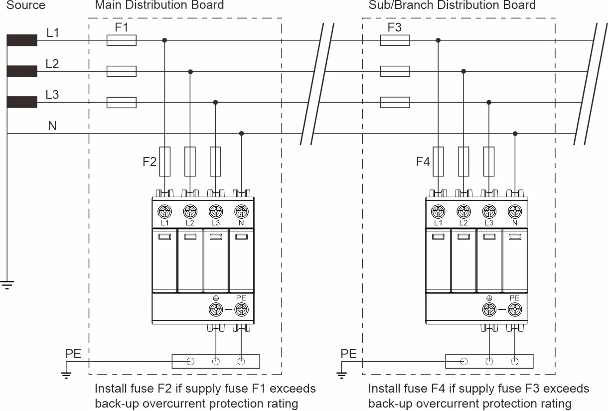
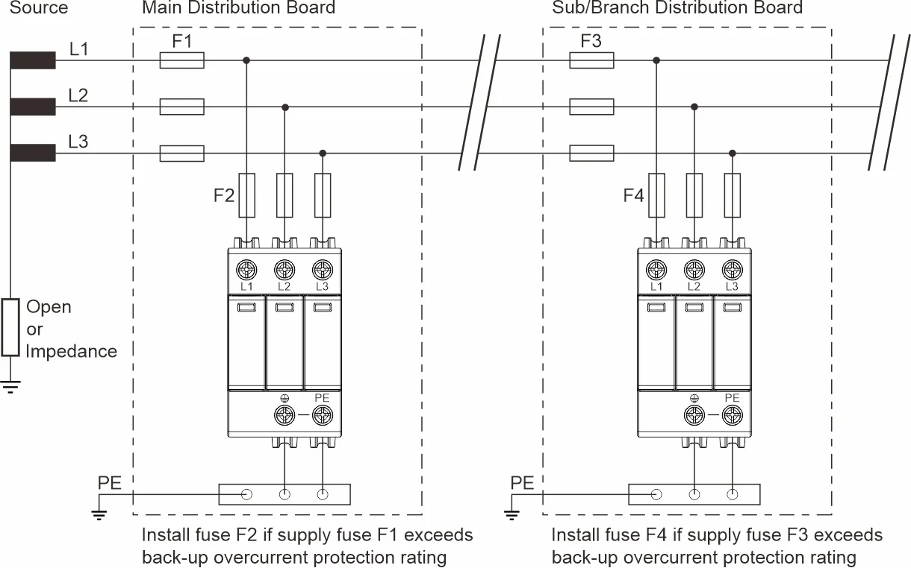
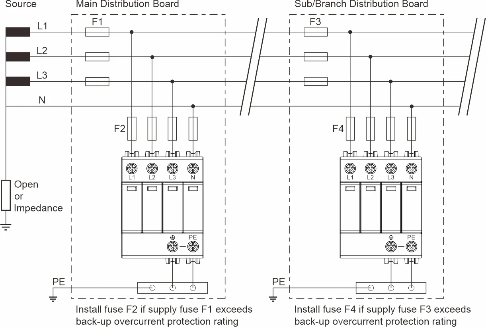

- 相关学习文章：交流电源系统浪涌保护器的选择与应用（IEC/EN系统）https://lsp.global/zh-CN/earthing-systems/
- ## TNC 接地系统
- 在该系统中，中性线和保护接地线在整个系统中合并为一根导线。 该导体称为 PEN，即“保护性接地和中性线”。 所有暴露的导电设备部件都连接到 PEN。
- 
- ## TNS 接地系统
- 在这个系统中，一个单独的中性和保护接地导体贯穿始终。 保护接地 (PE) 导体通常是单独的导体，但也可以是电源线的金属护套。 所有暴露的导电设备部件都连接到 PE 导体。
- 
- ## TNCS 接地系统
- 在该系统中，电源按照 TNC 配置，而下游安装按照 TNS 配置。 组合 PEN 导体通常出现在变电站和建筑物的入口点之间，地线和零线在主配电板中是分开的。 该系统也称为保护性多重接地 (PME) 或多重接地中性线 (MEN)。 供电 PEN 导线在整个网络的多个点接地，通常尽可能靠近消费者的接入点。
- 
- ## TT接地系统
- 一种系统，其中一个电源点接地，装置的外露导电部分连接到独立的接地电极。 输入电源中性线未在主配电板上接地。
- 
- ## IT接地系统
- 带电部件和大地之间没有直接连接，但安装的所有外露导电部件都连接到独立接地电极的系统。 电源通过高阻抗浮动或接地（以限制故障电流）。 这意味着在相接地故障期间，系统会继续运行。 这被检测到，并开始进行维护工作以纠正故障。 然而，在此期间，相对地电压上升到通常的线对线电压，并且安装的 SPD 必须在此期间承受此电压。 大多数已安装的 IT 系统不使用中性导体——设备由线到线供电。 IT 系统通常用于挪威和法国等国家的较旧设施。 它还用于特殊应用，例如医院的重症监护病房和特殊的工业应用。
- 
- 